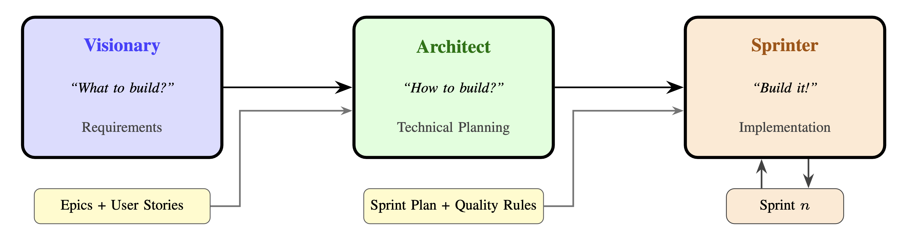

<p align="center">
  
  
  
</p>

<h1 align="center">Agile-AI</h1>
<h3 align="center">An Agentic Framework for AI-Assisted Software Development Using Scrum Principles</h3>

<p align="center">
  <i>Bringing engineering discipline to human-AI collaboration</i>
</p>

<p align="center">
  <a href="paper/Haja_2026_Agile-AI_Framework.pdf"><strong>📄 Read the Research Paper</strong></a> ·
  <a href="INSTALLATION.md"><strong>🚀 Get Started</strong></a> ·
  <a href="agile/docs/WORKFLOW.md"><strong>📖 Documentation</strong></a>
</p>

---

## Overview

**Agile-AI** is a research framework that transfers established Agile project management principles to AI-assisted software development. By adapting Scrum methodology to the unique characteristics of human-AI collaboration, it provides a structured alternative to unstructured "vibe coding."

The framework employs three specialized LLM agents—**Visionary**, **Architect**, and **Sprinter**—that guide users through structured phases of requirements engineering, technical planning, and iterative implementation.



> **Core Concept:** Instead of replacing the developer, Agile-AI positions the human as a **Product Owner** who defines requirements and validates results, while AI agents handle implementation details within strict architectural constraints.

---

## The Problem: "Vibe Coding" vs. Engineering

Current AI-assisted development often lacks structure. Developers interact with AI assistants in ad-hoc dialogues, leading to:
*   **Requirement Drift:** Initial goals are lost across long conversations.
*   **Scope Creep:** The ease of generating features leads to uncontrolled expansion.
*   **Context Loss:** AI models forget earlier instructions as context windows fill up.

**Agile-AI addresses these challenges by separating concerns:**
1.  First, figure out **what** to build (Vision).
2.  Then, figure out **how** to build it (Structure).
3.  Finally, **build** it iteratively (Work).

---

## The Three Agents

Each agent is responsible for a distinct phase and operates under strict constraints to ensure process discipline.

<table>
<tr>
<td width="33%" valign="top">

### 1. Visionary (Phase 1)
**"The Requirements Engineer"**

Conducts structured interviews to extract and document user needs. Turns vague ideas into concrete Epics and User Stories.

**Constraint:**
Cannot make technical decisions or write code. Must ask clarifying questions until requirements are specific.

**Output:**
- Project Vision
- Product Backlog (Epics & Stories)

</td>
<td width="33%" valign="top">

### 2. Architect (Phase 2)
**"The Technical Lead"**

Plans the implementation. Selects technologies, assesses feasibility, and creates a sprint plan.

**Constraint:**
Must preserve all user requirements. Adds technical tasks (`[TECH-ENABLER]`) but cannot delete user stories.

**Output:**
- Technical Architecture
- Definition of Done
- Sprint Plan

</td>
<td width="33%" valign="top">

### 3. Sprinter (Phase 3)
**"The Developer"**

Implements the software in iterative sprints. Writes code, runs tests, and delivers working increments.

**Constraint:**
**Scope Guard:** Refuses new feature requests during active sprints. Redirects them to the backlog.

**Output:**
- Working Software
- Sprint Reports
- Helper Scripts (`start.sh`)

</td>
</tr>
</table>

---

## Quick Start

### 1. Clone & Setup
```bash
git clone https://github.com/[username]/agile-ai.git
cd agile-ai
# See INSTALLATION.md for VS Code & OpenCode setup
```

### 2. Start Phase 1 (Vision)
Open the OpenCode chat and run:
```
/visionary-start
```
The agent will interview you about your project idea.

### 3. Start Phase 2 (Structure)
Once the vision is complete, run:
```
/architect-start
```
The agent will plan the technical implementation.

### 4. Start Phase 3 (Work)
To begin the first sprint:
```
/sprinter-start
```
The agent will implement the first set of features.

---

## Repository Structure

```
agile-ai/
├── .opencode/agents/           # Agent definitions (Markdown + YAML)
│   ├── visionary/              #   Phase 1: Requirements
│   ├── architect/              #   Phase 2: Planning
│   └── sprinter/               #   Phase 3: Implementation
│
├── agile/
│   ├── artifacts/              # Generated project documents
│   ├── templates/              # Document templates
│   └── docs/                   # Framework documentation
│
├── results/                    # Generated code output
├── paper/                      # Research Paper (PDF)
└── README.md
```

---

## Research Context

This framework was developed at the **Laboratory for Innovations in Engineering** at the University of Applied Sciences Emden/Leer, Germany. It addresses the need for new engineering practices as AI systems assume increasing responsibility for technical implementation.

The framework was evaluated in a pilot study with 30 Master's students, who successfully used it to develop browser-based multiplayer games without prior professional software development experience.

**[📄 Download the Technical Report (PDF)](paper/Haja_2026_Agile-AI_Framework.pdf)**

---

## Citation

If you use Agile-AI in your research, please cite:

```bibtex
@techreport{haja2026agileai,
  title       = {Agile-AI: A Three-Agent Framework for AI-Assisted 
                 Software Development Using Scrum Principles},
  author      = {Haja, Andreas},
  institution = {University of Applied Sciences Emden/Leer},
  year        = {2026},
  type        = {Technical Report v1.0}
}
```

---

<p align="center">
  <b>Prof. Dr. Andreas Haja</b><br/>
  Laboratory for Innovations in Engineering<br/>
  University of Applied Sciences Emden/Leer, Germany<br/>
  <a href="mailto:andreas.haja@hs-emden-leer.de">andreas.haja@hs-emden-leer.de</a>
</p>
