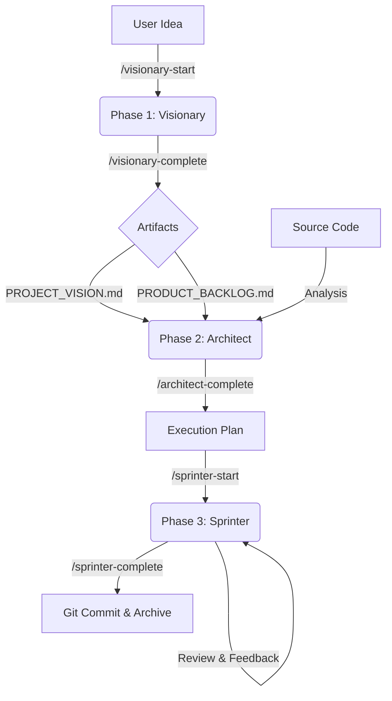

# The Agile Pipeline Workflow

This document describes how data flows through the AI-Assisted Scrum Framework.

## Detailed Steps

### 1. Vision (Visionary)
*   **Goal:** Clarity through structured interview.
*   **Input:** User Chat.
*   **Output:** 
    *   `agile/artifacts/01_vision/PROJECT_VISION.md` - Elevator Pitch, Scope, Roadmap
    *   `agile/artifacts/01_vision/PRODUCT_BACKLOG.md` - Epics & User Stories
    *   `agile/artifacts/01_vision/INTERVIEW_PROTOCOL.md` - Conversation record (for User)
    *   `agile/artifacts/01_vision/AGENT_LOG.md` - Todo states & decisions (for Debugging)
*   **Process:** 5-Step Interview (EXPLORE → DEFINE → STRUCTURE → DETAIL → VALIDATE)
*   **Quality:** INVEST criteria applied to all User Stories before completion.
*   **Logging:** Dual-log system - Protocol for conversation history, Agent Log for todo persistence.
*   **Completion:** Agent proposes readiness, User confirms with `/visionary-complete`.

### 2. Structure (Architect)
*   **Goal:** Feasibility & Slicing.
*   **Input:** Backlog & Source Code.
*   **Action:** Analysis of technical debt and dependencies.
*   **Output:** `agile/artifacts/02_structure/PRODUCT_BACKLOG.md` (Execution Plan).
*   **Key Logic:** Sprints are sliced by **Token Count**, not just time.

### 3. Work (Sprinter)
*   **Goal:** Autonomous Implementation & Delivery.
*   **Input:** Execution Plan (from Phase 2).
*   **Workspace:** `results/` (Code) & `agile/artifacts/03_work/` (Docs).
*   **Action:**
    1.  `/sprinter-start`: Initializes the Sprint Backlog.
    2.  **Implementation Loop:**
        *   Write Code in `results/`.
        *   Run Tests (autonomously).
        *   Ask User for Feedback.
    3.  **Completion:**
        *   `/sprinter-complete` triggers the QA Report (`SPRINT_REPORT.md`).
        *   Executes `git commit`.
